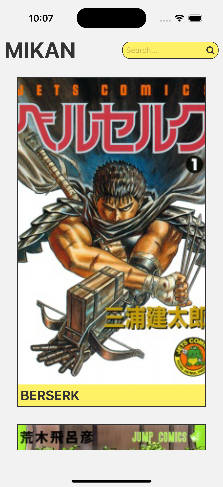
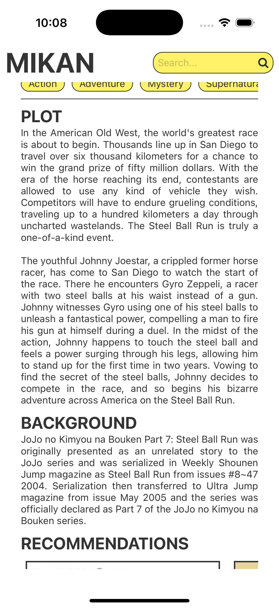
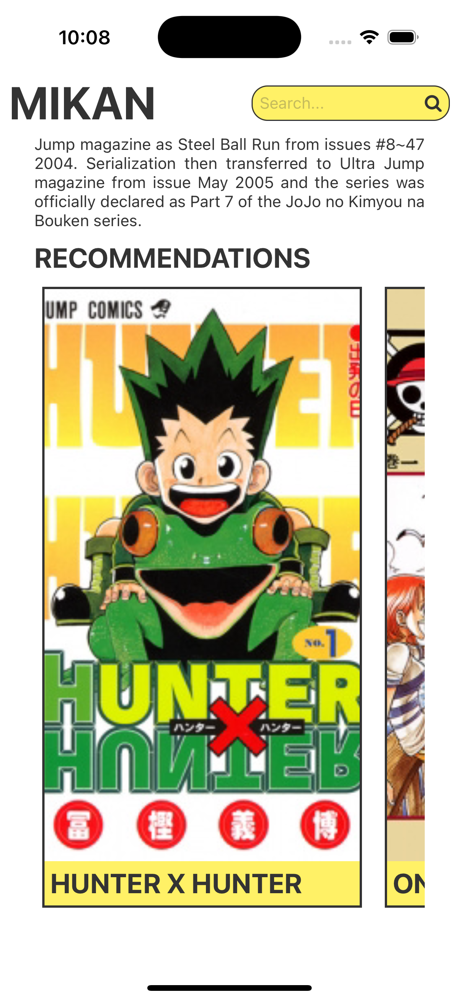

# MIKAN 📚

**MIKAN** is a mobile app that allows you to browse and discover manga using data from the [Jikan API](https://jikan.moe/), a free and open-source REST API for MyAnimeList.

With a sleek and minimal design, the app lets users:

- View top manga
- Search for manga by title
- View detailed manga information
- See recommendations for each manga

---

## 🛠️ Tech Stack

- [Expo](https://expo.dev/) (React Native framework)
- [React Native](https://reactnative.dev/)
- [TypeScript](https://www.typescriptlang.org/)
- [Jikan API](https://jikan.moe/) (MyAnimeList REST API)

---

## 📸 Screenshots

  
  
  
  

## 📄 License

This project is licensed under the MIT License. See the LICENSE file for details.